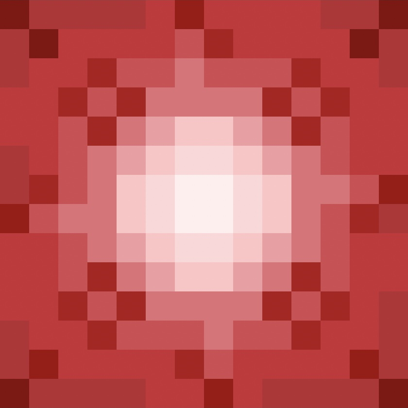

 

# The Kitchen’s Nether Beacon Mod [Fabric]

## This Mod is in Beta

I am showcasing some of the features in a beta version so that I can respond to community feedback for the first release.  If you download the mod right now, you will be able to experiment with a proof-of-concept nether beacon that may have bugs and lacks all the features detailed below.

## Introduction

Ever wanted to keep pesky mobs & players at bay and have a beacon all to yourself?  Now you can with the The Kitchen’s Nether Beacon mod!  This mod allows you to craft a new type of configurable beacon that draws upon the dark energy of the nether.

## A Personal Beacon 

 The nether beacon is bound to the player who places it.  Like the regular beacon block, it provides many different status effects when activated.  The major difference with the nether beacon is that it will only give you any beneficial effects and only give other mobs & players the harmful effects.  For example, placing the beacon and setting the bonus effect to slowness will give all other mobs & players slowness, while choosing saturation will only give you the saturation effect. 

The nether beacon can be crafted by placing a regular beacon and a netherite ingot into the smithing table.

A pyramid of polished blackstone bricks is needed to activate the beacon.

## Support This Mod

  
Support The Kitchen flavored mods by streaming my music:

- [YouTube](https://www.youtube.com/channel/UCw7YTR6oSIan42thJCtWC9g)
- [Apple Music](https://music.apple.com/us/artist/the-kitchen/1480129249)
- [Spotify](https://open.spotify.com/artist/3UZDsnAmnpGlFGlFyikvIt?si=9_Q_CU9dTWeuguzNHZesoQ&dl_branch=1)

